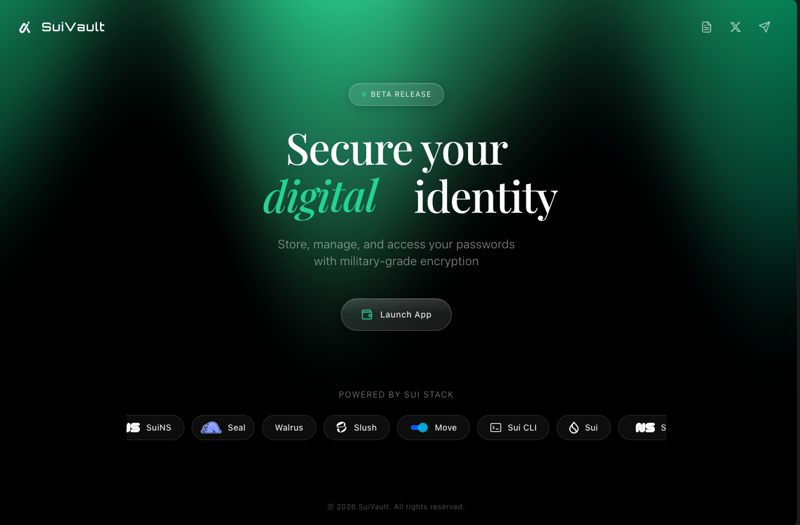

# SuiPass – Decentralized Password Manager



**Your Passwords, Truly Yours**

A decentralized password manager built on the **Sui blockchain** with **Seal encryption** and **Walrus decentralized storage**.

[](https://opensource.org/licenses/MIT)
[](https://sui.io)
[](https://www.typescriptlang.org/)
[](https://move-book.com/)

**Live Demo:** [https://suipass.lovable.app](https://suipass.lovable.app)

---


## 📚 Table of Contents

- [🔐 SuiPass – Decentralized Password Manager](#-suipass--decentralized-password-manager)
  - [📚 Table of Contents](#-table-of-contents)
  - [🌟 Overview](#-overview)
  - [✨ Key Features](#-key-features)
    - [🔒 Security \& Privacy](#-security--privacy)
    - [🚀 User Experience](#-user-experience)
    - [🌐 Web3 Native](#-web3-native)
  - [🤔 Why SuiPass?](#-why-suipass)
    - [Comparison with Traditional Password Managers](#comparison-with-traditional-password-managers)
  - [🔑 Key Differentiators](#-key-differentiators)
  - [🏗 Architecture](#-architecture)
    - [High-Level Design](#high-level-design)
  - [🔄 Data Flow](#-data-flow)
  - [🛠 Tech Stack](#-tech-stack)
  - [🚀 Getting Started](#-getting-started)
  - [📁 Project Structure](#-project-structure)
  - [💻 Development](#-development)
  - [🧪 Testing](#-testing)
  - [🚢 Deployment](#-deployment)
  - [📖 Documentation](#-documentation)
  - [🤝 Contributing](#-contributing)
  - [📄 License](#-license)
  - [🙏 Acknowledgments](#-acknowledgments)

---

## 🌟 Overview


**SuiPass** is a Web3-native password manager that puts **you** in full control of your data.

- 🔐 **True Privacy:** Seal encryption ensures only you can decrypt your passwords
- 📦 **True Ownership:** Data stored on Walrus, not centralized servers
- 🌍 **Always Available:** Decentralized storage, no vendor lock-in
- 💰 **Free Forever:** Only minimal gas fees (~$0.01 per operation)

---

## ✨ Key Features


### 🔒 Security & Privacy

- **Seal Encryption (Jan 2026):** Client-side encryption with decentralized key management
- **Walrus Storage:** Encrypted vaults stored on a censorship-resistant network
- **No Central Database:** Eliminates single points of failure

### 🚀 User Experience

- **Cross-Device Sync:** Automatic sync via Walrus
- **Browser Extension:** Autofill + quick access popup
- **Mobile Responsive:** Full-featured mobile web UI
- **Password Generator:** Cryptographically secure random passwords

### 🌐 Web3 Native

- **Sui Move Smart Contracts:** Immutable, auditable vault logic
- **On-Chain Metadata:** Vault ownership and versioning on Sui
- **PTB Support:** Efficient batch transactions
- **True Data Portability:** Export/import vault anytime

---

## 🤔 Why SuiPass?

### Comparison with Traditional Password Managers

| Feature | 1Password | Bitwarden | LastPass | **SuiPass** |
|------|-----------|-----------|----------|------------|
| Cost | $3–8/mo | $10/year | $3/mo | **~$2–5/year (gas only)** |
| Data Ownership | ❌ Company | ❌ Company | ❌ Company | **✅ You** |
| Decentralized | ❌ | ❌ | ❌ | **✅** |
| Vendor Lock-in | ✅ | ✅ | ✅ | **❌ No** |
| E2EE | ✅ | ✅ | ✅ | **✅** |
| Open Source | ❌ | ❌ | ❌ | **✅** |
| Recovery | Master password | Master password | Email | **Google OAuth** |

---

## 🔑 Key Differentiators

1. **User-owned data** via Walrus decentralized storage
2. **No subscriptions**, only gas fees
3. **Censorship resistant** by design
4. **Cutting-edge tech:** Seal, zkLogin, Walrus
5. **Privacy-first architecture** (zero-knowledge)

---

## 🏗 Architecture

### High-Level Design

```text
CLIENT LAYER
Web App | Browser Extension | Mobile Web
        |
INTEGRATION LAYER
Sui dApp Kit | Seal SDK | Walrus SDK
        |
--------------------------------
|                              |
Sui Blockchain            Walrus Storage
Vault Registry            Encrypted Blobs
```


## 🔄 Data Flow

**Adding a Password:**
1. User enters password
2. Frontend encrypts with Seal
3. Upload encrypted blob to Walrus → `blob_id`
4. Update Vault object on Sui
5. Transaction confirmed

**Retrieving a Password:**
1. Fetch Vault object from Sui
2. Download blob from Walrus
3. Decrypt with Seal
4. Display password

---

## 🛠 Tech Stack

**Smart Contracts:**
- Language: Sui Move 2024
- Network: Sui Testnet → Mainnet

**Frontend:**
- Framework: React 18 + TypeScript
- Build Tool: Vite 5
- Styling: Tailwind CSS 3
- UI: shadcn/ui
- State: TanStack Query + Zustand
- Sui SDK: @mysten/dapp-kit, @mysten/sui

**Infrastructure:**
- Storage: Walrus
- Encryption: Seal SDK (+ tweetnacl for MVP)
- Authentication: zkLogin (Google OAuth)

---

## 🚀 Getting Started

**Prerequisites:**
- Node.js v18+
- npm v9+

**Quick Start:**
```bash
npm install
npm run dev
```

## 📁 Project Structure
```
suipass/
├── public/extension/     # Browser extension (MV3)
├── src/
│   ├── components/
│   ├── hooks/
│   ├── lib/              # encryption, walrus, sui
│   ├── pages/
│   ├── types/
├── assets/
├── README.md
```

---

## 💻 Development

```bash
npm run lint
npm run build
npm run preview
```

---

## 🧪 Testing

Tests are not yet fully implemented. Contributions are welcome!

---

## 🚢 Deployment

This app can be deployed to any static hosting provider:
- Vercel
- Netlify
- Cloudflare Pages

---

## 📖 Documentation

- [Sui Documentation](https://docs.sui.io)
- [Move Book](https://move-book.com)

---

## 🤝 Contributing

1. Fork the repository
2. Create a feature branch
3. Commit changes
4. Push to branch
5. Open a Pull Request

---

## 📄 License

MIT License

---

## 🙏 Acknowledgments

- Mysten Labs (Sui)
- Walrus
- Seal

---

Made with ❤️ for the Sui ecosystem

⭐ Star this repo if you find it useful